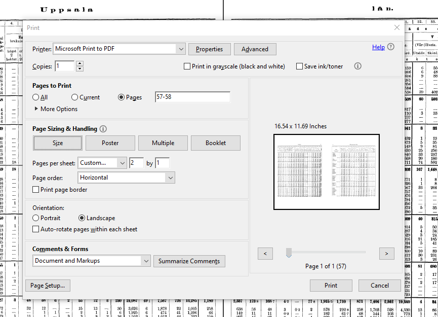
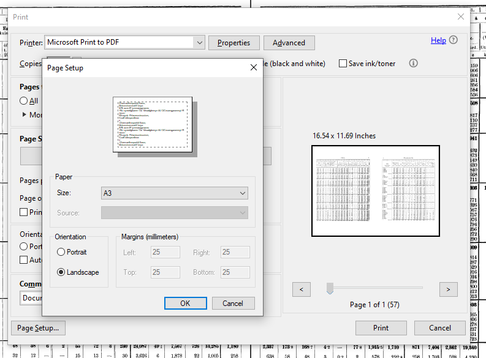
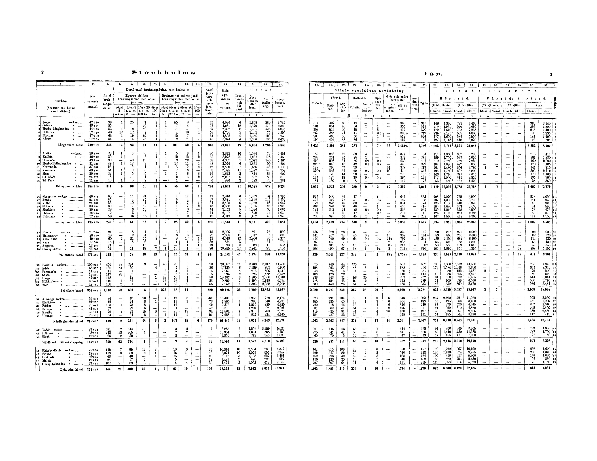
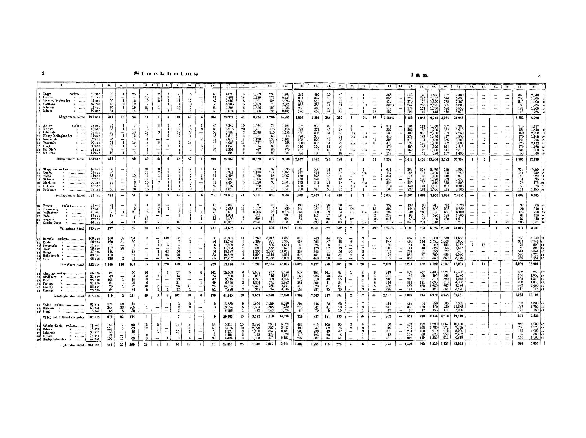

```{r setup, include=FALSE}
knitr::opts_chunk$set(echo = TRUE)
```

## Purpose

Explainer -

Hi John, thanks for being willing to help with this task!

I lay out the process here and provide some examples.

### Document

The source document is called the Hushållnings-sällskapens Berättelser. 

They range in date from 1865 to 1911.

They are stored on the linked [Google drive](https://drive.google.com/drive/folders/1KyL5ln_CJjEj_ZVXOtHifo2LD21nIiaw?usp=sharing). 

### Process

#### Aligning tables on PDFs

To ingest the data we need to extract the tables from the long PDF documents, align the tables that stretch across pages, remove the headers, and then save them with the name of the country and an index for the page.

To extract the tables, I have been using Adobe Acrobat Reader to print the tables which stretch across pages onto one page. 

I have selected 'multiple' under page sizing and handling, 2 by 1 in pages per sheet, and landscape under orientation. See the image below.



In order to keep the output as high quality as possible, I have chosed to save the PDFs as A3 under page setup. See the image below.



### Cutting out headers and white space

At this point we need to remove the white space between the tables, and remove the table headers that lie below the index in the top row.

It is important to keep all of the top index numbers visible so that the extraction tool aligns them well.

I have used Irfan View image editor for this purpose, but use InDesign as you please. 

The image starts looking like this: 



The output should look like this, in either pdf or jpeg image format. Here the table headers are cut out, and the white space is removed.



Thank you John, and please shout if you have any questions.


